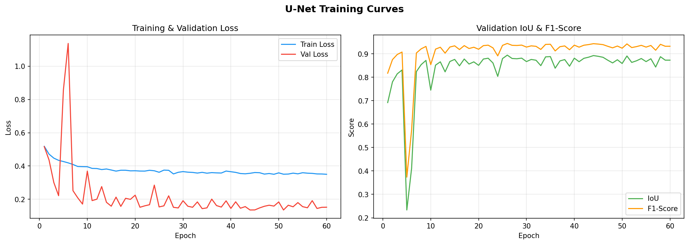
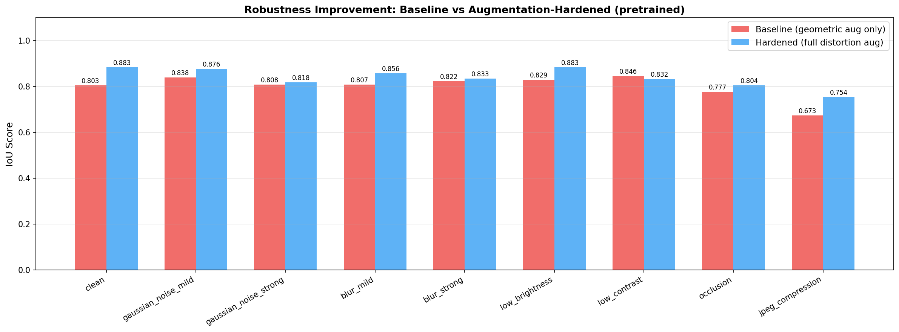
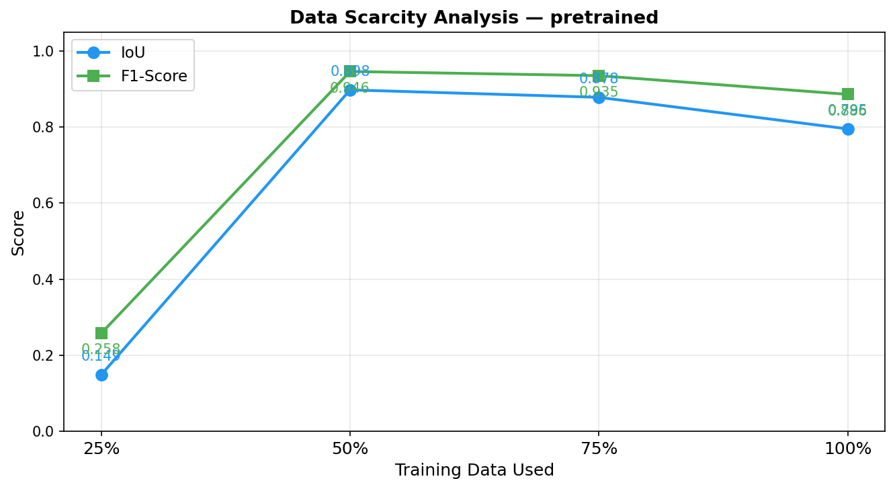
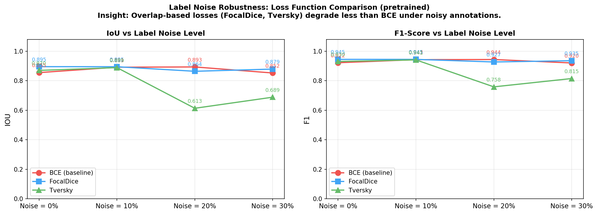
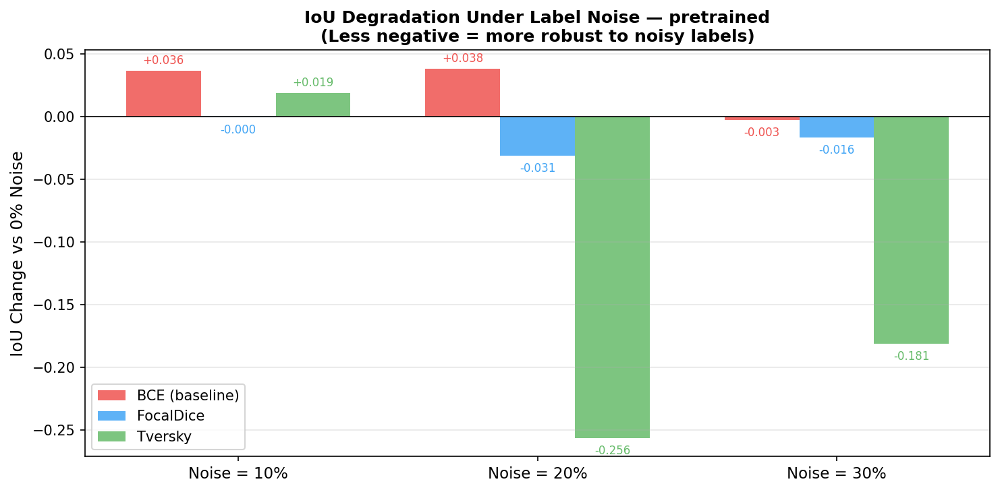
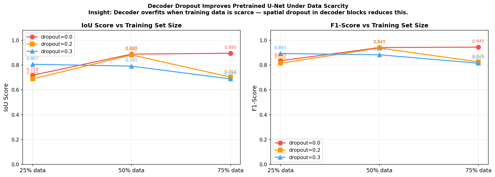

# 🌾 Wheat Crop Segmentation

> UNSW COMP9517 Group Project 2026 T1  
> **EWS (Eschikon Wheat Segmentation) Dataset**

---

## 📋 Overview

This project implements binary segmentation of wheat crops from field images using deep learning — two U-Net variants trained on the EWS dataset.

Given an RGB image, the model produces a binary mask classifying every pixel as either **wheat** or **soil**.

---

## 📁 Project Structure

```
wheat-segmentation/
├── data/
│   ├── dataset.py              # EWSDataset loader with subset & label-noise support
│   └── distortions.py          # Synthetic distortions for robustness testing
├── models/
│   ├── unet.py                 # Vanilla U-Net (from scratch)
│   ├── unet_pretrained.py      # U-Net with pretrained ResNet-34 encoder + decoder dropout
│   └── losses.py               # BCE, Dice, Focal, Tversky, Combo, FocalDice
├── utils/
│   ├── metrics.py              # Precision, Recall, F1, IoU
│   ├── tta.py                  # Test-Time Augmentation (6-fold)
│   ├── postprocess.py          # Morphological post-processing + parameter tuning
│   └── visualise.py            # Prediction grids, failure analysis, training curves
├── experiments/
│   ├── robustness_eval.py      # Evaluate under 9 image distortions
│   ├── robustness_improvement.py  # Baseline vs augmentation-hardened model comparison
│   ├── data_scarcity.py        # Train with 25/50/75/100% data fractions
│   ├── label_noise_analysis.py # Compare loss functions under noisy annotations
│   └── dropout_scarcity.py     # Decoder dropout regularisation under data scarcity
├── results/
│   ├── figures/                # Prediction grids, failure analysis, training curves
│   ├── robustness/             # Robustness evaluation results
│   ├── robustness_improvement/ # Baseline vs hardened model results
│   ├── scarcity/               # Data scarcity experiment results
│   ├── label_noise/            # Label noise analysis results
│   ├── dropout_scarcity/       # Decoder dropout experiment results
│   ├── pretrained_focal_dice/  # Pretrained U-Net training history
│   ├── unet_combo/             # Vanilla U-Net training history
│   ├── test_metrics_pretrained.json
│   └── test_metrics_unet.json
├── train.py                    # Main deep learning training script
├── evaluate.py                 # Test set evaluation with TTA + post-processing
└── requirements.txt
```

---


## 🧠 Deep Learning — U-Net Models

Two architectures trained and compared on the EWS dataset.

### Architecture 1 — Vanilla U-Net

Standard encoder-decoder with skip connections:
- **Encoder:** 4× (DoubleConv + MaxPool) — channels: 3 → 64 → 128 → 256 → 512
- **Bottleneck:** DoubleConv at 1024 channels
- **Decoder:** 4× (TransposeConv + skip concat + DoubleConv)
- **Head:** 1×1 Conv → binary logit
- BatchNorm + Spatial Dropout (p=0.1) throughout
- **Loss:** BCE + Dice (Combo, α=0.5)

### Architecture 2 — Pretrained U-Net

ResNet-34 encoder pretrained on ImageNet:
- **Encoder stages:** stem (64ch) → layer1 (64ch) → layer2 (128ch) → layer3 (256ch) → layer4 (512ch)
- **Decoder:** 4× DecoderBlock with skip connections from ResNet stages
- **Two-phase training:**
  - Phase 1 (10 epochs): encoder frozen, LR = 1e-4
  - Phase 2 (30 epochs): full fine-tune, LR = 1e-5
- **Loss:** Focal + Dice (FocalDice, α=0.5, γ=2.0)

### Loss Functions

| Loss | Use Case |
|---|---|
| **Combo** (BCE + Dice) | Reliable baseline |
| **FocalDice** (Focal + Dice) | Class imbalance + boundary precision |
| **Tversky** | Maximise recall for thin structures |

### Data Augmentation

Applied during training only:

| Type | Transforms |
|---|---|
| **Geometric** | HFlip, VFlip, Rot90, ShiftScaleRotate, ElasticTransform, GridDistortion |
| **Photometric** | ColorJitter, RandomGamma, GaussianBlur, GaussNoise, ISONoise |
| **Occlusion** | CoarseDropout (random patch blackout) |
| **Normalisation** | ImageNet mean/std (0.485, 0.456, 0.406) |

### Test-Time Augmentation (TTA)

6-fold TTA at inference — original + hflip + vflip + rot90 + rot180 + rot270. Sigmoid probability maps are averaged before thresholding at 0.5.

---

## 🏆 Results Summary

### Test Set Performance

| Model | Precision | Recall | F1-Score | IoU | Inference (ms/img) |
|---|---|---|---|---|---|
| Vanilla U-Net | 0.9606 | 0.9139 | 0.9358 | **0.8806** | 437 |
| Vanilla U-Net + TTA | 0.9615 | 0.9151 | 0.9369 | **0.8825** | 2575 |
| Pretrained U-Net | 0.9648 | 0.8530 | 0.9041 | 0.8271 | **105** |
| Pretrained U-Net + TTA | 0.9697 | 0.8612 | 0.9107 | 0.8383 | 741 |

**Key finding:** Vanilla U-Net achieves higher IoU (0.881 vs 0.838), while the Pretrained U-Net is 4× faster at inference (105ms vs 437ms). TTA consistently improves IoU at the cost of inference time.

---

### Training Curves



---

### Prediction Examples — Pretrained U-Net

> Each row: **Input Image | Ground Truth | Prediction | Error Map**  
> Error map: White = True Positive, Red = False Positive, Blue = False Negative


---

### Prediction Examples — Vanilla U-Net


---

### Failure Analysis — Pretrained U-Net

> The 6 worst predictions by IoU score, showing where the model struggles most.


---

### Failure Analysis — Vanilla U-Net


---

## 🔬 Experiments

### 1. Robustness Evaluation

The pretrained U-Net was evaluated under 9 synthetic image distortions simulating realistic field conditions:

| Distortion | IoU | vs Clean (0.827) |
|---|---|---|
| Low Contrast | 0.857 | **+0.030** ✅ |
| Low Brightness | 0.856 | **+0.029** ✅ |
| Gaussian Noise (mild) | 0.843 | +0.016 ✅ |
| Gaussian Noise (strong) | 0.798 | -0.029 |
| Occlusion | 0.785 | -0.042 |
| Blur (mild) | 0.765 | -0.062 |
| Blur (strong) | 0.757 | -0.070 |
| **JPEG Compression** | **0.685** | **-0.142** ❌ |


**Key findings:**
- The model is **robust to photometric changes** due to aggressive colour jitter augmentation
- **JPEG compression is the biggest weakness** (-0.142 IoU) — boundary artefacts confuse the model
- Under **blur**, precision stays high but recall drops — model misses wheat pixels

---

### 2. Robustness Improvement — Augmentation Hardening

**Insight:** The baseline model (geometric augmentation only) is brittle under distortions it was never trained on. Training with distortion-aware augmentation (noise, blur, colour jitter, elastic distortion) significantly improves robustness.

Two models trained and evaluated under all 9 distortions:

| Distortion | Baseline IoU | Hardened IoU | Gain |
|---|---|---|---|
| Clean | 0.803 | **0.883** | +0.080 |
| Gaussian Noise (mild) | 0.838 | **0.876** | +0.038 |
| Gaussian Noise (strong) | 0.808 | **0.818** | +0.010 |
| Blur (mild) | 0.807 | **0.856** | +0.049 |
| Blur (strong) | 0.822 | **0.833** | +0.011 |
| Low Brightness | 0.829 | **0.883** | +0.054 |
| Low Contrast | **0.846** | 0.832 | -0.014 |
| Occlusion | 0.777 | **0.804** | +0.027 |
| JPEG Compression | 0.673 | **0.754** | +0.081 |



**Key finding:** Augmentation hardening improves IoU on 8 out of 9 distortions. The biggest gains are on JPEG compression (+0.081) and clean images (+0.080), showing that distortion-aware training generalises even to undistorted inputs.

---

### 3. Data Scarcity Analysis

The model was trained with varying fractions of the training set (30 epochs each):

| Training Data | Images | IoU | F1 |
|---|---|---|---|
| 25% | 35 | 0.149 | 0.258 |
| 50% | 71 | **0.898** | **0.946** |
| 75% | 106 | 0.878 | 0.935 |
| 100% | 142 | 0.795 | 0.886 |



**Key finding:** The model collapses at 25% data (35 images). 50% data outperforms 100% at 30 epochs — the pretrained encoder converges faster with fewer images. This motivates decoder dropout regularisation (see Experiment 5).

---

### 4. Label Noise Analysis

**Insight:** Under noisy annotations, BCE loss is penalised per mislabelled pixel, causing rapid degradation. Overlap-based losses (Dice, Focal) operate on aggregate pixel statistics, making individual noisy pixels less impactful.

Models trained at 0–30% label noise, evaluated on a clean validation set:

| Loss | 0% noise | 10% noise | 20% noise | 30% noise | Drop at 30% |
|---|---|---|---|---|---|
| BCE | 0.855 | 0.892 | 0.893 | 0.852 | -0.003 |
| **FocalDice** | **0.895** | **0.895** | 0.864 | **0.879** | **-0.016** |
| Tversky | 0.870 | 0.889 | 0.613 | 0.689 | -0.181 |




**Key finding:** FocalDice is the most stable loss function — only 0.016 IoU drop at 30% noise. Tversky collapses severely at 20%+ noise (-0.181 at 30%). BCE is surprisingly robust at low noise but FocalDice consistently achieves higher absolute IoU across all noise levels, confirming it as the best choice for noisy annotation settings.

---

### 5. Decoder Dropout Under Data Scarcity

**Insight from Experiment 3:** At 25% data, the pretrained encoder's features are strong but the randomly-initialised decoder overfits. Adding spatial Dropout2d inside decoder blocks constrains only the undertrained part of the network.

Three dropout levels (0.0, 0.2, 0.3) tested across data fractions:

| Data Fraction | dropout=0.0 | dropout=0.2 | dropout=0.3 |
|---|---|---|---|
| 25% (35 images) | 0.718 | 0.689 | **0.807** |
| 50% (71 images) | **0.888** | 0.882 | 0.791 |
| 75% (106 images) | **0.895** | 0.703 | 0.689 |



**Key finding:** At 25% data, dropout=0.3 improves IoU by +0.089 over the baseline. At 75% data, dropout hurts — the model has enough data to self-regularise. This validates that the dropout is addressing decoder overfitting specifically under scarcity, not just adding noise.

---

## ⚙️ Setup & Usage

### Installation

```bash
pip install -r requirements.txt
```

### Dataset Structure

```
EWS-Dataset/
├── train/images/   train/masks/
├── val/images/     val/masks/
└── test/images/    test/masks/
```

> ⚠️ Never mix train/val/test splits. Test set used only for final evaluation.

### Training

```bash
# Pretrained U-Net
python train.py \
    --model pretrained \
    --data_root ./EWS-Dataset \
    --loss focal_dice \
    --epochs 40 \
    --two_phase \
    --phase1_epochs 10

# Vanilla U-Net
python train.py \
    --model unet \
    --data_root ./EWS-Dataset \
    --loss combo \
    --epochs 60
```

### Evaluation

```bash
python evaluate.py \
    --data_root ./EWS-Dataset \
    --checkpoint ./results/pretrained_focal_dice/best.pth \
    --model pretrained \
    --tta \
    --visualise \
    --failure_analysis
```

### Robustness Evaluation

```bash
python experiments/robustness_eval.py \
    --data_root ./EWS-Dataset \
    --checkpoint ./results/pretrained_focal_dice/best.pth \
    --model pretrained
```

### Robustness Improvement

```bash
python experiments/robustness_improvement.py \
    --data_root ./EWS-Dataset \
    --model pretrained \
    --epochs 40
```

### Data Scarcity

```bash
python experiments/data_scarcity.py \
    --data_root ./EWS-Dataset \
    --model pretrained \
    --epochs 30
```

### Label Noise Analysis

```bash
python experiments/label_noise_analysis.py \
    --data_root ./EWS-Dataset \
    --model pretrained \
    --epochs 30
```

### Decoder Dropout Under Scarcity

```bash
python experiments/dropout_scarcity.py \
    --data_root ./EWS-Dataset \
    --epochs 40
```

---

## 📦 Dependencies

| Library | Purpose |
|---|---|
| PyTorch + torchvision | Training framework + ResNet-34 pretrained weights |
| albumentations | Augmentation pipelines |
| OpenCV | Classical segmentation + distortion simulation |
| matplotlib | Result visualisation |
| numpy | Numerical operations |

All code is original group work. ResNet-34 weights sourced from torchvision (ImageNet).

---

## 📖 References

1. Ronneberger et al. "U-Net: Convolutional Networks for Biomedical Image Segmentation." MICCAI 2015.
2. He et al. "Deep Residual Learning for Image Recognition." CVPR 2016.
3. Lin et al. "Focal Loss for Dense Object Detection." ICCV 2017.
4. Salehi et al. "Tversky Loss Function for Image Segmentation." MICCAI 2017.
5. Zenkl et al. "Outdoor Plant Segmentation With Deep Learning for High-Throughput Field Phenotyping on a Diverse Wheat Dataset." Frontiers in Plant Science 2022.
